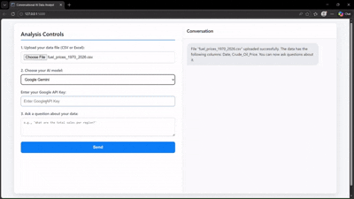
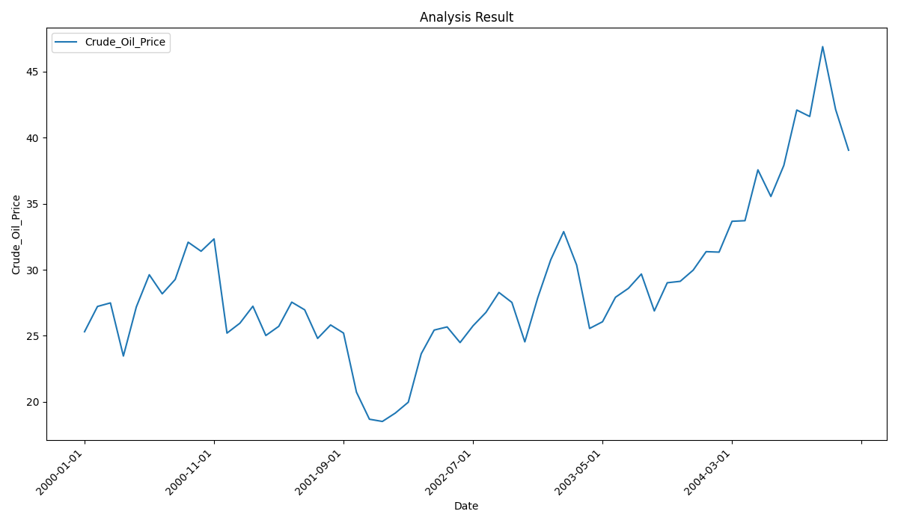
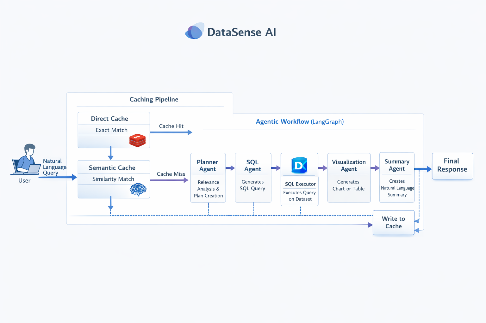

# 🧠 DataSense AI — Autonomous Data Analyst


## 🎯 What is DataSense AI?

DataSense AI is a full-stack AI-powered application that acts as your personal senior data analyst.

Upload a dataset, ask a question in plain English, and the system will:
- Generate SQL queries
- Execute them safely
- Create visualizations
- Explain insights in natural language

All powered by a stateful multi-agent AI workflow.

## 🔥 Why This Matters

Traditional data analysis requires:
- SQL expertise
- Manual visualization tools
- Time-consuming exploration

DataSense AI removes all friction by enabling instant insights through natural language.

## 👀 For Recruiters

This project demonstrates:

- Multi-agent AI system design using LangGraph
- Natural Language → SQL pipeline
- Intelligent visualization generation
- Hybrid AI + deterministic system design
- Secure API key handling (BYOK model)
- Full-stack deployment with Docker

The architecture and agent workflow reflect real-world AI system design patterns.

## 🎥 Demo & Screenshots




**Upload & Query Interface**


**Generated Visualization**



## 🚀 Features

- 🧠 **Natural Language → SQL:** LLM-powered query generation.
- 📊 **Automated Data Analysis:** Safe DuckDB execution.
- 📈 **Intelligent Chart Generation:** Auto-detection of chart axes.
- 📝 **Contextual Summaries:** Clear explanations of results.
- 🔄 **Multi-Agent Architecture:** Robust workflow using LangGraph.
- ⚡️ **Dual-Layer Caching:** In-memory semantic and Redis/Filesystem-backed direct caching to boost performance and reduce costs.
- 🔌 **Multi-LLM Support:** Switch between Gemini and Cohere.
- 🔐 **Bring Your Own API Key (BYOK):** Securely use your own keys.

## ⚡ Quick Start (Docker)

1.  Clone the repository:
    ```bash
    git clone https://github.com/Yeshw-anth/DataSense-AI
    cd DataSense-AI
    ```
2.  Create your environment file from the example:
    ```bash
    cp .env.example .env
    ```
    *(Then, edit `.env` with your actual keys if not using the UI.)*

3.  Build and run the Docker container:
    ```bash
    docker build -t datasense-ai -f docker/Dockerfile .
    docker run -p 8000:8000 --env-file .env datasense-ai
    ```

4.  Open your browser and navigate to `http://localhost:5000/`.

## 💻 Local Development

For those who prefer to run without Docker:

1.  **Setup Environment:**
    ```bash
    # Create and activate a virtual environment
    python -m venv .venv
    source .venv/bin/activate  # or .venv\Scripts\activate on Windows

    # Install dependencies
    pip install -r requirements.txt
    ```

2.  **Run Redis (If Using Redis Cache):**
    ```bash
    # If your .env is set to CACHE_TYPE=redis, you need a Redis server running.
    # The simplest way to do this is with Docker, even if you run the app locally.
    docker run -d -p 6379:6379 redis
    ```

## ⚙️ Configuration

The application's behavior can be configured via environment variables set in the `.env` file.

| Variable                              | Description                                                                                                                                | Default Value     |
| ------------------------------------- | ------------------------------------------------------------------------------------------------------------------------------------------ | ----------------- |
| `CACHE_TYPE`                          | Sets the backend for the direct cache. Can be `redis` for a robust, shared cache or `filesystem` for simple, local-only caching.             | `filesystem`      |
| `REDIS_URL`                           | The connection URL for the Redis server, used only if `CACHE_TYPE` is set to `redis`.                                                      | `redis://localhost:6379` |
| `SEMANTIC_CACHE_ENABLED`              | Toggles the semantic cache on (`True`) or off (`False`).                                                                                   | `True`            |
| `SEMANTIC_CACHE_SIMILARITY_THRESHOLD` | The similarity score (from 0.0 to 1.0) required for a semantic cache hit. Higher values mean more strict matching.                        | `0.8`             |
| `GOOGLE_API_KEY`                      | Your API key for Google AI services (e.g., Gemini). Required if using the `google` provider.                                               | `None`            |
| `COHERE_API_KEY`                      | Your API key for Cohere services. Required if using the `cohere` provider.                                                                 | `None`            |

3.  **Run the App:**
    ```bash
    # This starts the Flask development server
    python app.py
    ```

4.  Open your browser and navigate to `http://127.0.0.1:5000/`.

## 🚀 Deployment

This application is designed to be deployed as a containerized web service on platforms like Render, Heroku, or AWS.

### Docker Container Registry

For platforms that pull from a container registry (like Docker Hub, GCR, or ECR):

1.  Build and tag your image:
    ```bash
    docker build -t your-registry/datasense-ai:latest -f Dockerfile .
    ```
2.  Push the image to your registry:
    ```bash
    docker push your-registry/datasense-ai:latest
    ```
3.  Configure your service to pull and run this image. The `CMD` in our `Dockerfile` is already configured to start the server correctly, so no start command override is needed.

## 🔑 API Key Handling (BYOK)

DataSense AI follows a **Bring Your Own Key (BYOK)** model:
- Users provide their own API keys via the UI for each request.
- Keys are sent securely to the backend for that specific job.
- Keys are **never stored** on the server or exposed in the frontend code.
- Each request is isolated and stateless regarding keys.

### ✅ Benefits
- **Secure:** No need to trust the server with long-term key storage.
- **Scalable:** Avoids centralized API key management bottlenecks.
- **Cost-Controlled:** Users are responsible for their own LLM usage costs.

## 💡 Example Workflow

**User Query:**
> "Show total sales by region"

**Generated SQL:**
```sql
SELECT region, SUM(sales) AS total_sales
FROM data
GROUP BY region;
```

**Output:**
- 📊 A bar chart visualizing sales for each region.
- 📝 A text summary explaining the performance insights.

## 🧠 System Architecture

### 🔄 End-to-End Flow

`User Query` → `Direct Cache` → `Semantic Cache` → `Planner Agent` → `SQL Agent` → `SQL Executor (DuckDB)` → `Visualization Agent` → `Summary Agent` → `Write to Cache`

### 🤖 The Agentic Workflow: A Closer Look

The core of DataSense AI is a team of specialized agents, orchestrated by LangGraph. Each agent has a single, well-defined responsibility.

1.  **Planner Agent:**
    - **Role:** The "Gatekeeper" and "Project Manager."
    - **Function:** It performs the most critical first step: **relevance analysis**. It determines if the user's query can be answered by the data. If it can, it then creates a step-by-step plan and determines the best visualization to use (`bar`, `line`, or `table`). If not, it stops the process early, saving time and resources.

2.  **SQL Agent:**
    - **Role:** The "Database Expert" and "Code Generator."
    - **Function:** Takes the plan from the Planner and the table's schema to write a precise and executable DuckDB SQL query. This is the primary code generation step in the pipeline.

3.  **Visualization Agent:**
    - **Role:** The "Data Artist."
    - **Function:** Receives the raw data from the SQL execution. It operates in a hybrid model for optimal performance and intelligence:
        - **Primary Method (Deterministic):** First, it attempts to generate the chart using a fast, heuristic-based approach to identify the best X and Y axes.
        - **Fallback Method (AI-Powered):** If the heuristic fails, it uses an LLM (Gemini or Cohere) to intelligently determine the correct axes, making it robust for complex datasets.

4.  **Summary Agent:**
    - **Role:** The "Business Analyst" and "Communicator."
    - **Function:** Reviews the user's original question and the final data results to write a clear, human-readable summary of the findings, explaining what the data and the chart mean.

### 🧩 Architecture Diagram




## 🛠️ Tech Stack

- **Backend:** Python, Flask, Waitress
- **AI/Orchestration:** LangChain, LangGraph
- **Database:** DuckDB (in-memory)
- **Frontend:** HTML5, CSS3, Vanilla JavaScript
- **Deployment:** Docker
- **Supported LLMs:** Google Gemini, Cohere

## ⚙️ Environment Variables

| Variable       | Description              | Required |
|----------------|--------------------------|----------|
| `GEMINI_API_KEY` | Default Gemini API key   | No       |
| `COHERE_API_KEY` | Default Cohere API key   | No       |
| `FLASK_ENV`      | Set to `development` or `production` | No       |


## 📂 Project Structure
```
.
├── agents/
├── api/
├── assets/
├── data/
├── evaluation/
├── execution/
├── pipelines/
├── static/
├── templates/
├── utils/
├── app.py
├── config.py
├── extensions.py
├── README.md
└── requirements.txt
```

## ⚠️ Limitations
- Best suited for structured, clean datasets (CSV/Excel).
- The in-memory database may struggle with very large files.
- Does not yet support joining multiple datasets.
- Chart types are now dynamically suggested and include bar, line, scatter, pie, histograms, and heatmaps.

## 🛠️ Troubleshooting

- **App not starting:** Ensure Docker is running and that port 8000 is not in use by another application.
- **Invalid API Key:** Double-check that the key is correct and has been enabled for the respective service (e.g., AI Platform for Gemini).
- **No chart generated:** The query might not have produced data suitable for visualization. Try a query that aggregates data, like "total sales by category."

## 🧭 Roadmap
- [x] Caching results for repeated or similar queries.
- [x] More advanced chart types (scatter plots, heatmaps).
- [ ] Multi-dataset querying and joins.
- [ ] Persistent storage options (e.g., PostgreSQL).
- [ ] User authentication and saved history.


## 🤝 Contributing
Contributions are welcome! Please Fork → Branch → Commit → Pull Request.

## ⭐ Support
If you find this project useful, please consider giving it a star on GitHub!

## 📄 License
This project is licensed under the MIT License.
